# html-anything

[](https://skills.sh/clockless-org/html-anything)

Turn an idea, file, folder, or URL into a polished live HTML page.

`html-anything` is a Codex / Claude Code skill. Give it a prompt like
"create an interactive teaching site about the solar system", or give it
an export like Amazon orders, WhatsApp chat, a CSV, a transcript, a repo,
or a folder of notes. The skill figures out the source, chooses the page
style automatically, builds the HTML, checks it in a browser, and gives
you something you can open, share, or publish.

## Preview

- [Open all live examples](https://clockless-org.github.io/html-anything/examples/)
- [Teaching style: solar system lesson](https://clockless-org.github.io/html-anything/examples/solar-system-studio/output.html)
- [Relationship report: realistic couple chat](https://clockless-org.github.io/html-anything/examples/wechat-couple/output.html)

[](https://clockless-org.github.io/html-anything/examples/solar-system-studio/output.html)

[](https://clockless-org.github.io/html-anything/examples/wechat-couple/output.html)

## Auto Style Gallery

Each source is routed by `auto` to the page shape that fits it best. These thumbnails are screenshots of the committed live HTML examples.

<table>
<tr>
<td width="33%"><a href="https://clockless-org.github.io/html-anything/examples/solar-system-studio/output.html">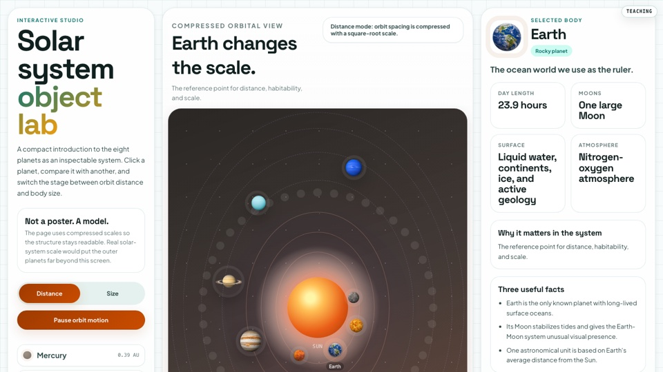</a><br><strong>Solar system lesson</strong><br><code>teaching</code></td>
<td width="33%"><a href="https://clockless-org.github.io/html-anything/examples/wechat-couple/output.html"></a><br><strong>Couple chat report</strong><br><code>relationship</code></td>
<td width="33%"><a href="https://clockless-org.github.io/html-anything/examples/whatsapp/output.html"></a><br><strong>WhatsApp relationship</strong><br><code>relationship</code></td>
</tr>
<tr>
<td width="33%"><a href="https://clockless-org.github.io/html-anything/examples/amazon-orders/output.html">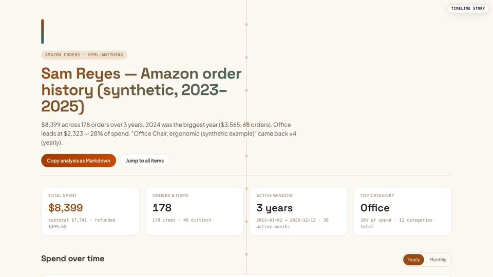</a><br><strong>Amazon order history</strong><br><code>personal-atlas</code></td>
<td width="33%"><a href="https://clockless-org.github.io/html-anything/examples/google-photos-takeout/output.html">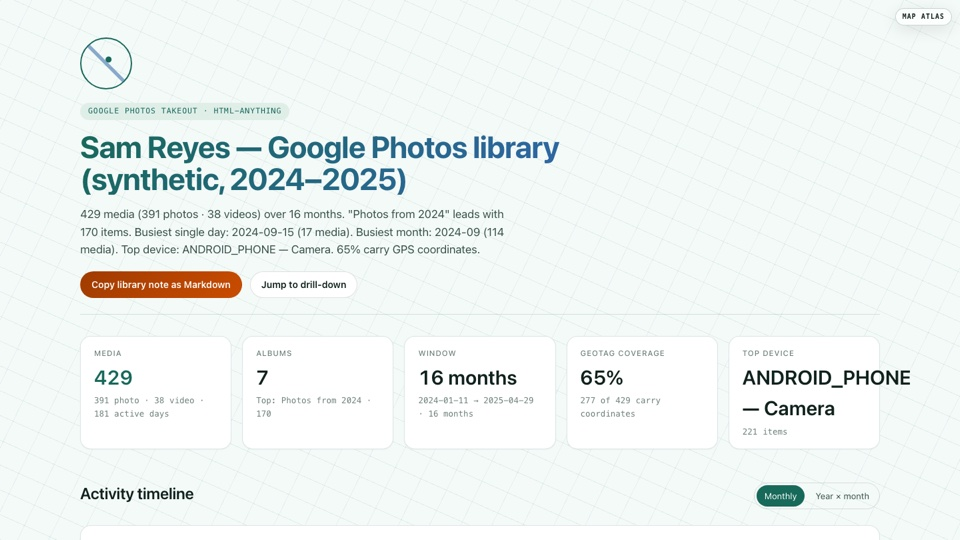</a><br><strong>Google Photos atlas</strong><br><code>personal-atlas</code></td>
<td width="33%"><a href="https://clockless-org.github.io/html-anything/examples/google-maps-stars/output.html"></a><br><strong>Saved places atlas</strong><br><code>personal-atlas</code></td>
</tr>
<tr>
<td width="33%"><a href="https://clockless-org.github.io/html-anything/examples/rideshare-history/output.html">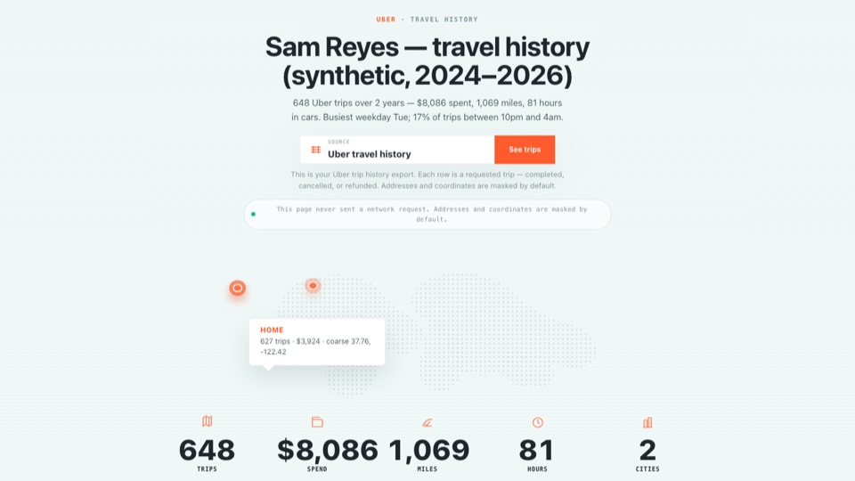</a><br><strong>Rideshare history</strong><br><code>personal-atlas</code></td>
<td width="33%"><a href="https://clockless-org.github.io/html-anything/examples/spotify-history/output.html">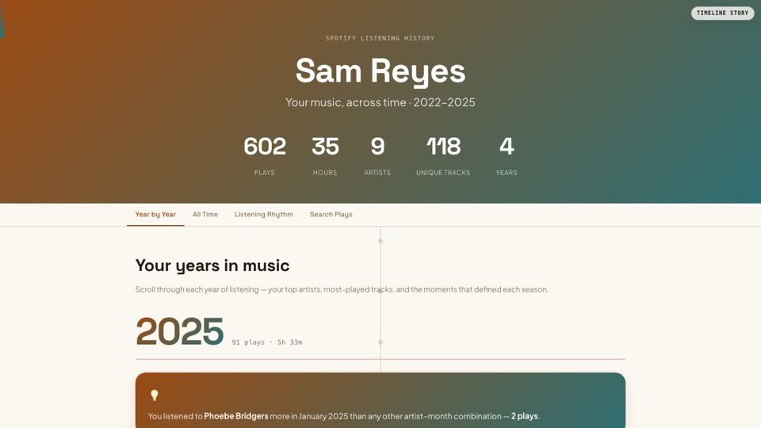</a><br><strong>Spotify history</strong><br><code>personal-atlas</code></td>
<td width="33%"><a href="https://clockless-org.github.io/html-anything/examples/youtube-watch-history/output.html">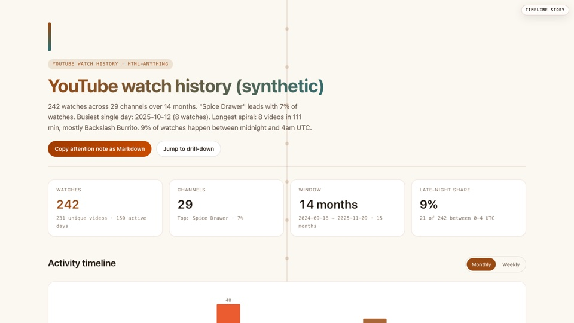</a><br><strong>YouTube watch history</strong><br><code>personal-atlas</code></td>
</tr>
<tr>
<td width="33%"><a href="https://clockless-org.github.io/html-anything/examples/iphone-health/output.html">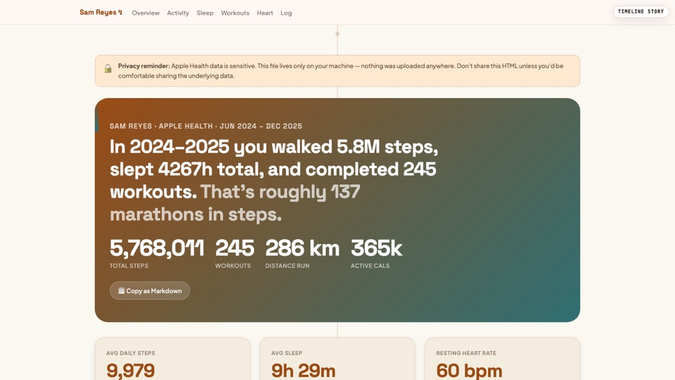</a><br><strong>Apple Health story</strong><br><code>personal-atlas</code></td>
<td width="33%"><a href="https://clockless-org.github.io/html-anything/examples/kindle-highlights/output.html">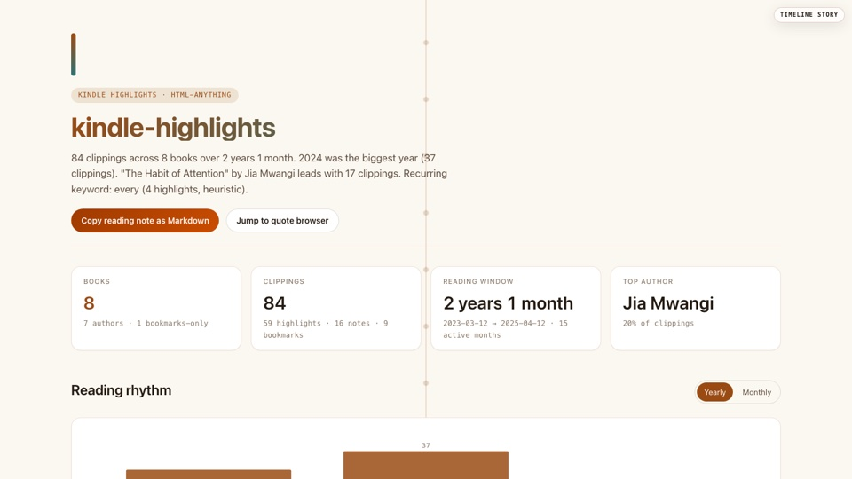</a><br><strong>Kindle highlights</strong><br><code>personal-atlas</code></td>
<td width="33%"><a href="https://clockless-org.github.io/html-anything/examples/twitch-history/output.html">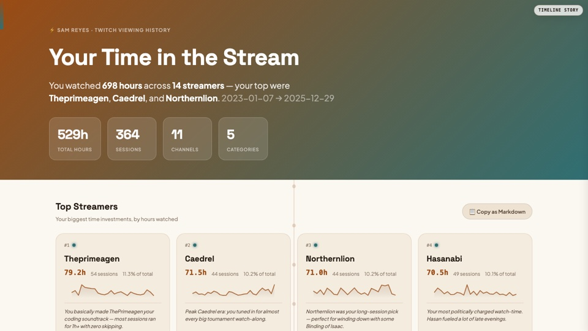</a><br><strong>Twitch viewing</strong><br><code>personal-atlas</code></td>
</tr>
<tr>
<td width="33%"><a href="https://clockless-org.github.io/html-anything/examples/venmo-paypal-payments/output.html">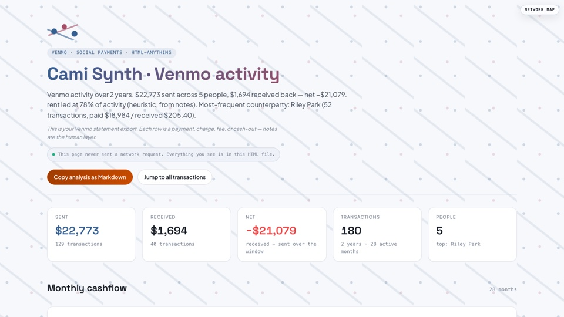</a><br><strong>Venmo / PayPal payments</strong><br><code>personal-atlas</code></td>
<td width="33%"><a href="https://clockless-org.github.io/html-anything/examples/vcard-contacts/output.html">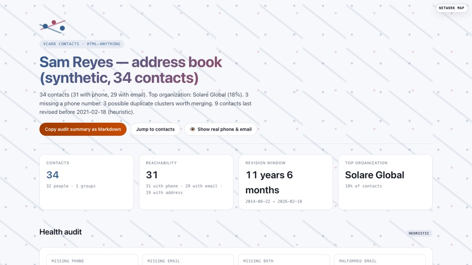</a><br><strong>Address book audit</strong><br><code>personal-atlas</code></td>
<td width="33%"><a href="https://clockless-org.github.io/html-anything/examples/linkedin-connections/output.html">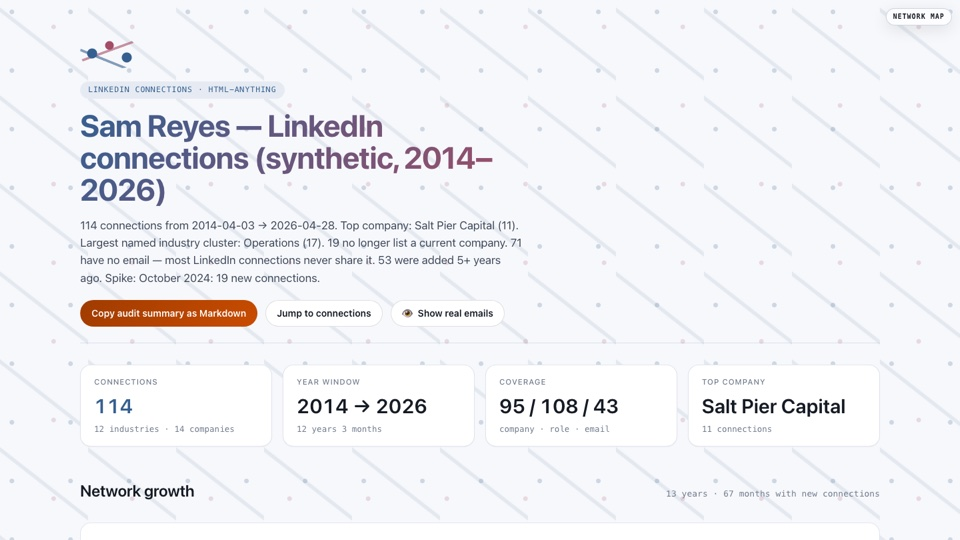</a><br><strong>LinkedIn network</strong><br><code>personal-atlas</code></td>
</tr>
<tr>
<td width="33%"><a href="https://clockless-org.github.io/html-anything/examples/chatgpt-export/output.html">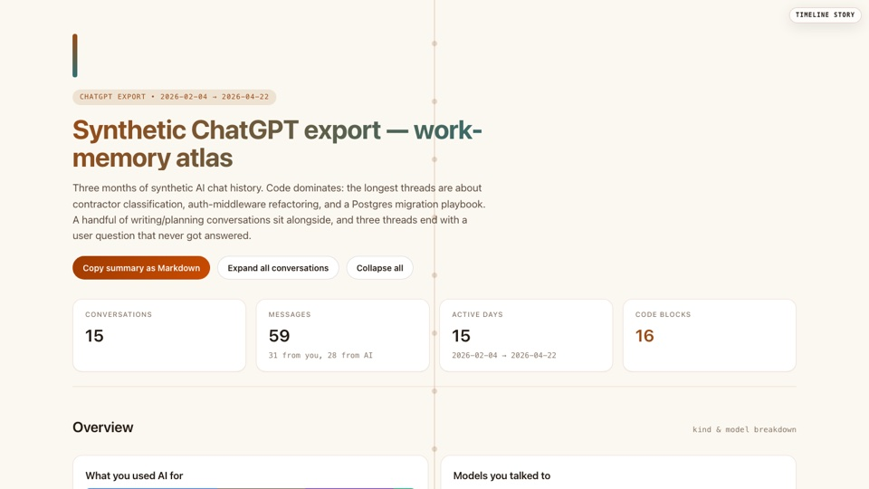</a><br><strong>ChatGPT export</strong><br><code>personal-atlas</code></td>
<td width="33%"><a href="https://clockless-org.github.io/html-anything/examples/ai-chat-log/output.html">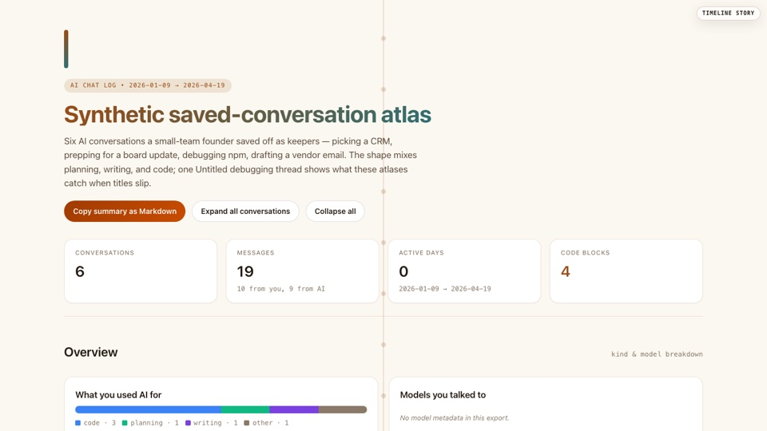</a><br><strong>AI chat log</strong><br><code>personal-atlas</code></td>
<td width="33%"><a href="https://clockless-org.github.io/html-anything/examples/csv/output.html"></a><br><strong>CSV sales dashboard</strong><br><code>dashboard</code></td>
</tr>
<tr>
<td width="33%"><a href="https://clockless-org.github.io/html-anything/examples/jsonl/output.html"></a><br><strong>JSONL event stream</strong><br><code>dashboard</code></td>
<td width="33%"><a href="https://clockless-org.github.io/html-anything/examples/log-access/output.html"></a><br><strong>Access log</strong><br><code>dashboard</code></td>
<td width="33%"><a href="https://clockless-org.github.io/html-anything/examples/log-error/output.html"></a><br><strong>Error log</strong><br><code>dashboard</code></td>
</tr>
<tr>
<td width="33%"><a href="https://clockless-org.github.io/html-anything/examples/slack/output.html">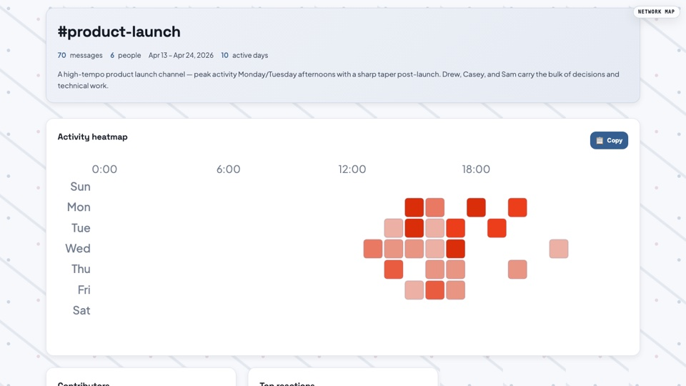</a><br><strong>Slack channel</strong><br><code>dashboard</code></td>
<td width="33%"><a href="https://clockless-org.github.io/html-anything/examples/discord/output.html">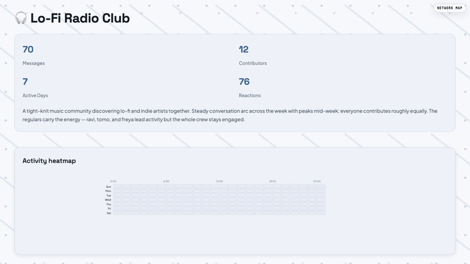</a><br><strong>Discord community</strong><br><code>dashboard</code></td>
<td width="33%"><a href="https://clockless-org.github.io/html-anything/examples/telegram/output.html">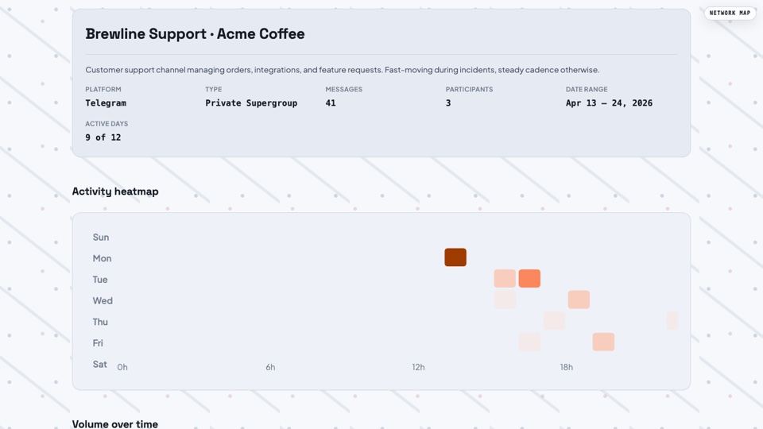</a><br><strong>Telegram export</strong><br><code>dashboard</code></td>
</tr>
<tr>
<td width="33%"><a href="https://clockless-org.github.io/html-anything/examples/email/output.html">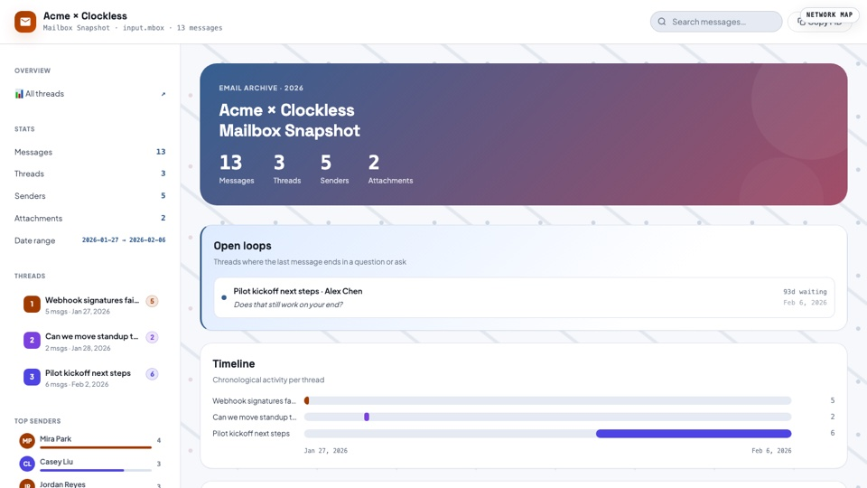</a><br><strong>Email archive</strong><br><code>dashboard</code></td>
<td width="33%"><a href="https://clockless-org.github.io/html-anything/examples/transcript-sales-call/output.html"></a><br><strong>Sales-call transcript</strong><br><code>dashboard</code></td>
<td width="33%"><a href="https://clockless-org.github.io/html-anything/examples/transcript-product-meeting/output.html"></a><br><strong>Product-meeting transcript</strong><br><code>dashboard</code></td>
</tr>
<tr>
<td width="33%"><a href="https://clockless-org.github.io/html-anything/examples/markdown/output.html">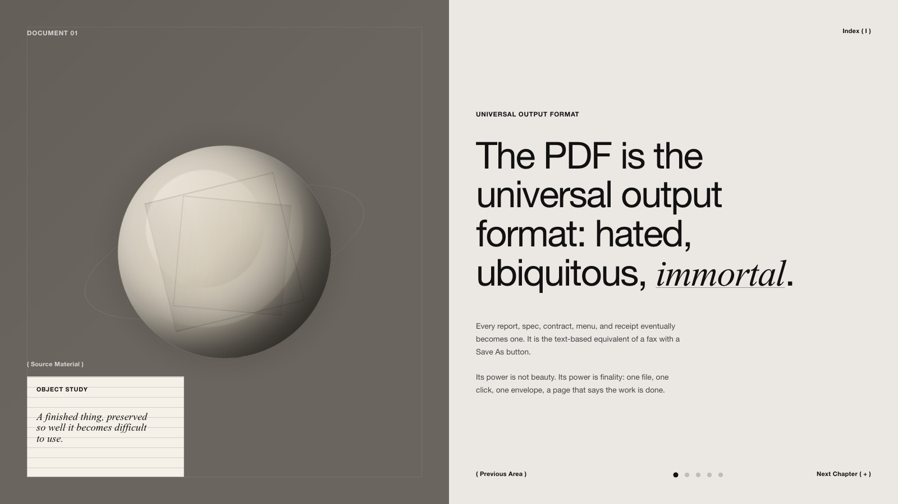</a><br><strong>Markdown essay</strong><br><code>editorial</code></td>
<td width="33%"><a href="https://clockless-org.github.io/html-anything/examples/bookmarks-market-research/output.html"></a><br><strong>Market bookmarks</strong><br><code>editorial</code></td>
<td width="33%"><a href="https://clockless-org.github.io/html-anything/examples/reading-list-academic/output.html"></a><br><strong>Academic reading list</strong><br><code>editorial</code></td>
</tr>
<tr>
<td width="33%"><a href="https://clockless-org.github.io/html-anything/examples/pdf/output.html"></a><br><strong>PDF report</strong><br><code>paper</code></td>
<td width="33%"><a href="https://clockless-org.github.io/html-anything/examples/docx/output.html">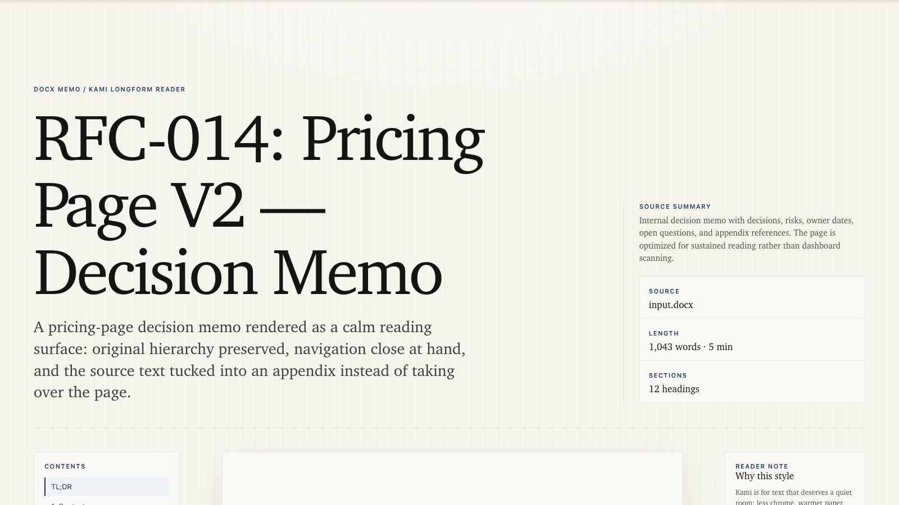</a><br><strong>DOCX decision memo</strong><br><code>paper</code></td>
<td width="33%"><a href="https://clockless-org.github.io/html-anything/examples/medical-visit/output.html"></a><br><strong>Medical visit note</strong><br><code>paper</code></td>
</tr>
<tr>
<td width="33%"><a href="https://clockless-org.github.io/html-anything/examples/lab-results/output.html"></a><br><strong>Lab results</strong><br><code>paper</code></td>
<td width="33%"><a href="https://clockless-org.github.io/html-anything/examples/legal-chronology/output.html"></a><br><strong>Legal chronology</strong><br><code>paper</code></td>
<td width="33%"><a href="https://clockless-org.github.io/html-anything/examples/git-diff/output.html"></a><br><strong>Git diff review</strong><br><code>developer</code></td>
</tr>
<tr>
<td width="33%"><a href="https://clockless-org.github.io/html-anything/examples/pr-review/output.html"></a><br><strong>PR patch review</strong><br><code>developer</code></td>
<td width="33%"><a href="https://clockless-org.github.io/html-anything/examples/ci-log/output.html"></a><br><strong>CI failure log</strong><br><code>developer</code></td>
<td width="33%"><a href="https://clockless-org.github.io/html-anything/examples/stack-trace/output.html"></a><br><strong>Stack trace</strong><br><code>developer</code></td>
</tr>
</table>

Additional source fixtures that map cleanly to auto styles but do not yet have committed gallery thumbnails (the `output.html` for each lives next to its `examples/<source>/input.*`):

| Source fixture | Auto style |
|---|---|
| Browser history (browser-history) — Chrome / Edge / Brave / Safari / Firefox CSV or JSON history exports. Domain leaderboard, topic clusters, research sessions, returners, repeated searches; URLs only in the drill-down detail. | `personal-atlas` |
| Product backlog (backlog-product) | `dashboard` |
| Bank transactions (bank-transactions) | `dashboard` |
| Founder calendar (calendar-founder) | `dashboard` |
| Invoices (invoices) | `dashboard` |
| QuickBooks ledger (quickbooks) | `dashboard` |
| Travel itinerary (itinerary-trip) | `personal-atlas` |
| GPX run route (run-route) | `personal-atlas` |
| Markdown notes vault (notes-vault) | `personal-atlas` |

## Install

### Codex

```bash
mkdir -p "${CODEX_HOME:-$HOME/.codex}/skills"
git clone https://github.com/clockless-org/html-anything "${CODEX_HOME:-$HOME/.codex}/skills/html-anything"
```

Restart Codex so it loads the skill.

### Claude Code

```bash
mkdir -p ~/.claude/skills
git clone https://github.com/clockless-org/html-anything ~/.claude/skills/html-anything
```

Restart Claude Code so it loads `SKILL.md`.

### Agent Skills CLI

```bash
npx skills add clockless-org/html-anything
```

To update a manual install later:

```bash
git -C "${CODEX_HOME:-$HOME/.codex}/skills/html-anything" pull
```

## Use

Ask in plain language:

```text
Use html-anything to create an interactive teaching site about the solar system.
```

```text
Use html-anything on my Amazon order history. Walk me through the export first.
```

```text
Use html-anything to turn ~/Downloads/_chat.txt into a relationship report.
```

```text
Use html-anything to make this CSV into a shareable dashboard.
```

```text
Use html-anything on this GitHub repo URL.
```

If you already have the file, folder, or URL, give it to the agent. If
you only know the source type, such as "Amazon orders", "Spotify history",
"WhatsApp chat", or "Google Photos Takeout", the skill first explains how
to export the data, then converts it after you provide the export.

## Input And Output

| Input | What you give | What you get |
|---|---|---|
| Idea | A short brief, e.g. "make a solar system teaching site" | A generated educational / interactive HTML page |
| File | CSV, JSON, Markdown, PDF, DOCX, chat export, log, transcript, statement | A live page designed for that file |
| Folder | Notes vault, Google Photos Takeout, Notion export, repo, exported archive | A browsable atlas / dashboard / audit page |
| URL | Article, GitHub repo, public webpage | A shareable HTML reading or exploration page |
| Export request | "My Amazon orders", "my Spotify history", "my WhatsApp chat" | Export instructions first, then a live HTML page |

The output is a browser page, not markdown. Most outputs are a single
`output.html`. When the page needs generated images or other local
assets, the skill returns `output.html + assets/`. Ask for "single-file"
if you need everything in one HTML file.

## Automatic Styles

You do not need to choose a style. The default is `auto`.

Styles are underlying page systems, not CSS skins. The skill picks the
system from the content, then builds the page inside that system:

| Content | Typical style system |
|---|---|
| Unknown or mixed inputs | Insight Brief |
| Tutorials, lessons, explainers, "teach me" prompts | Lesson Lab |
| Objects, scientific topics, product specs, system explainers | Object Studio |
| Chats and relationship exports | Rhythm Report |
| Orders, finance, spreadsheets, operational data | Ops Console / Memory Atlas |
| Essays, reading lists, bookmarks, personal history | Editorial Desk / Memory Atlas |
| Logs, diffs, stack traces, CI failures | Evidence Workbench |
| Medical, legal, papers, long documents | Review Dossier |

You can still steer it naturally: "make it more tutorial-like", "more
app-like", "less academic", "more dashboard-like", "more editorial", or
"more playful".

Reusable style prompts live in [`prompts/styles/`](./prompts/styles/).
The shared structural contract is
[`prompts/styles/_system.md`](./prompts/styles/_system.md). There is a
fallback `default` style plus eight auto-selected specialized styles:
`teaching`, `interactive-studio`, `relationship`, `dashboard`,
`personal-atlas`, `editorial`, `developer`, and `paper`.

## Source Examples

|  | Source family | Examples |
|---|---|---|
| 💾 | Personal exports | Amazon orders, rideshare history, browser history (Chrome / Edge / Safari / Firefox), YouTube watch history, Spotify history, Google Maps saved places, Apple Health, Twitch, Kindle highlights |
| 🖼️ | Photos and contacts | Google Photos Takeout metadata, vCard contacts, LinkedIn connections |
| 💬 | Chats and communities | WeChat, WhatsApp, Slack, Discord, Telegram, iMessage-style CSV |
| 📊 | Data and operations | CSV / TSV, JSON, JSONL, logs, bank transactions, invoices, QuickBooks, Venmo / PayPal, calendar, issue trackers |
| 📚 | Documents and research | Markdown, PDF, DOCX, email archives, bookmarks, URL lists, bibliographies, reading lists, Notion / Obsidian / markdown folders |
| 🛠️ | Developer artifacts | Git diff, PR patch, CI log, stack trace, GitHub repo URL |
| 🗺️ | Geo and travel | GPX, KML, itinerary CSV, location history |
| 🔒 | Sensitive records | Medical visit notes, lab results, legal chronologies |
| 🤖 | AI chat exports | ChatGPT, Claude, generic AI chat logs |
| ✨ | Anything else | Plain text, unknown file shapes, or a natural-language idea |

The detailed source-specific instructions live in [`prompts/`](./prompts/).

## Defaults

- The skill chooses the style automatically.
- The skill samples large sources, but renders the full data where practical.
- The skill checks the page in a browser before handing it back.
- Generated pages are local-first and static. They can be opened directly or hosted anywhere static HTML works.
- Generated HTML can embed private source data client-side. Treat the output as sensitive as the original export.
- Sensitive-record outputs are for organization and review only, not medical, legal, tax, accounting, immigration, insurance, or investment advice.

## Developer Note

This repo also contains a standalone parser / CLI framework used by some
examples, but the primary product surface is the agent skill. Users should
not need to understand the internal implementation to use html-anything.

```bash
git clone https://github.com/clockless-org/html-anything
cd html-anything
npm install
export ANTHROPIC_API_KEY=sk-ant-...   # or OPENAI_API_KEY=sk-...
npx tsx src/cli.ts examples/csv/input.csv --out /tmp/customers.html
```

## License

[Apache 2.0](./LICENSE)
