# html-anything

> **The agent skill that turns anything into a beautiful, shareable HTML page.**
> Rich answers, files, folders, URLs, and messy service exports become verified
> single-file `.html` artifacts with source-aware parsing, automatic style
> routing, **60 source prompts**, and **17 concrete style systems**. Short chats
> stay short; page-worthy answers become pages.

<p align="center">
  <a href="https://skills.sh/clockless-org/html-anything"></a>
  <a href="https://github.com/clockless-org/html-anything/stargazers"></a>
  <a href="https://github.com/clockless-org/html-anything/blob/main/LICENSE"></a>
  <a href="./prompts/sources"></a>
  <a href="./prompts/styles"></a>
  <a href="https://clockless-org.github.io/html-anything/examples/"></a>
</p>

`html-anything` works inside Codex and Claude Code. Ask for a teaching site,
drop in a PDF, upload a CSV, point it at a folder, or hand it an export like
Amazon orders, Kindle highlights, Spotify history, WeChat / iMessage,
Google Photos Takeout, logs, GPX, and more. The skill figures out the source,
chooses the right use case and style, builds the page, checks it in a browser,
and hands back a live HTML artifact instead of a long Markdown reply.

## Why this exists

AI agents are outgrowing plain Markdown. Inspired by Claude Code team member
Thariq Shihipar's viral
[“The Unreasonable Effectiveness of HTML”](https://x.com/trq212/status/2052809885763747935),
`html-anything` treats HTML as the richer response format: denser, more visual,
more interactive, and easier to share when the answer is really a page.

<table>
<tr>
<td width="100%" valign="top">
<h3>Before: plain response</h3>
<p>A long scroll of text for “Teach me solar system”. Useful, but hard to explore.</p>
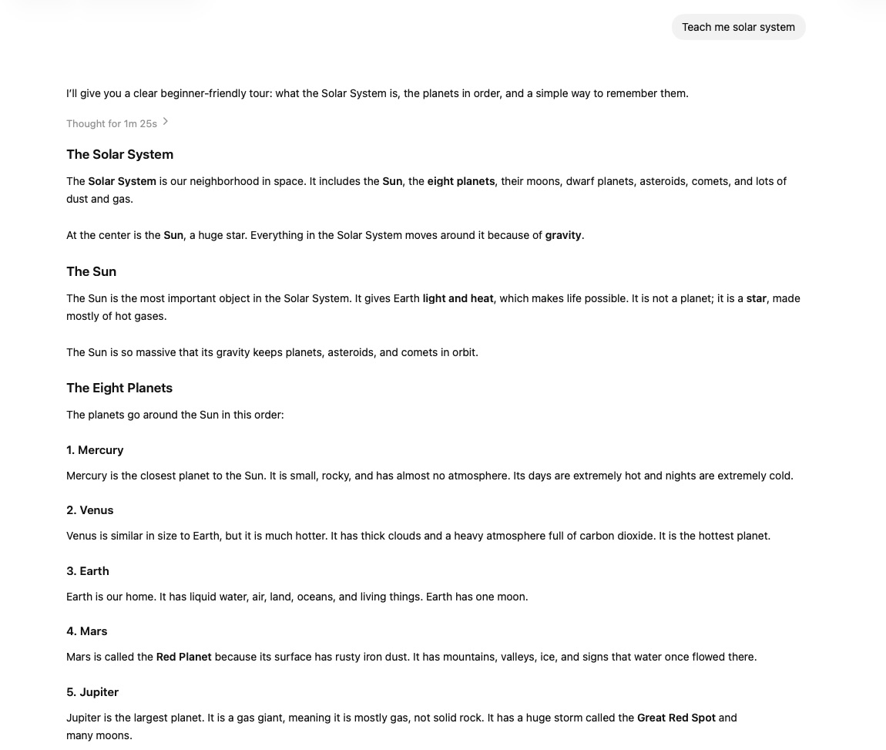
</td>
</tr>
<tr>
<td align="center">
<strong>↓</strong><br>
<sub>Same intent, richer response format</sub>
</td>
</tr>
<tr>
<td width="100%" valign="top">
<h3>After: live HTML artifact</h3>
<p>The same teaching goal becomes a visual, interactive learning page.</p>
<a href="https://clockless-org.github.io/html-anything/examples/solar-system-studio/output.html"></a>
</td>
</tr>
</table>

## Preview

<p align="center">
  <a href="https://clockless-org.github.io/html-anything/examples/"><strong>Open gallery →</strong></a>
</p>

### Teaching Studios

<table>
<tr>
<td width="50%" valign="top">
<a href="https://clockless-org.github.io/html-anything/examples/solar-system-studio/output.html">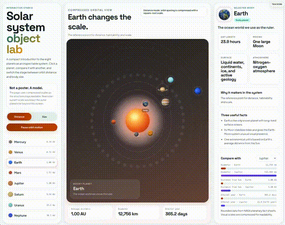</a><br>
<strong><a href="https://clockless-org.github.io/html-anything/examples/solar-system-studio/output.html">Teach a concept →</a></strong><br>
<sub>Source: teaching brief · Style: <code>teaching</code></sub>
</td>
<td width="50%" valign="top">
<a href="https://clockless-org.github.io/html-anything/examples/markdown/output.html">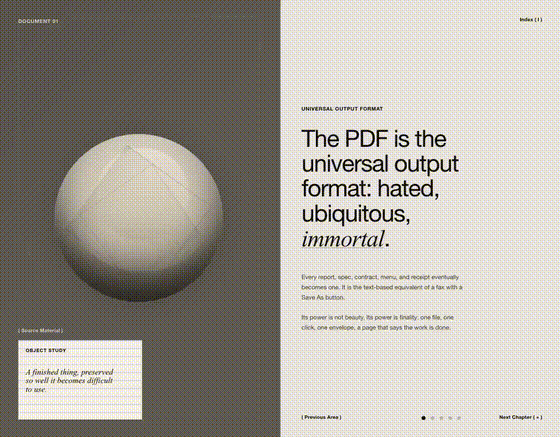</a><br>
<strong><a href="https://clockless-org.github.io/html-anything/examples/markdown/output.html">Learn from long-form text →</a></strong><br>
<sub>Source: Markdown file · Style: <code>architectural-spread</code></sub>
</td>
</tr>
<tr>
<td width="50%" valign="top">
<a href="https://clockless-org.github.io/html-anything/examples/docx/output.html">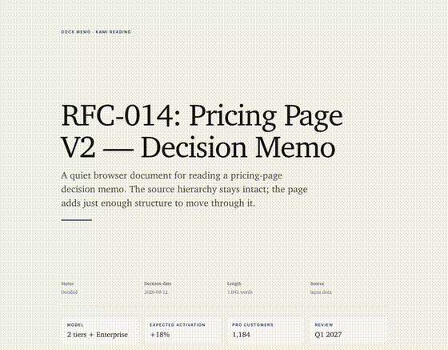</a><br>
<strong><a href="https://clockless-org.github.io/html-anything/examples/docx/output.html">Learn from a document →</a></strong><br>
<sub>Source: DOCX file · Style: <code>kami-reading</code></sub>
</td>
<td width="50%" valign="top"></td>
</tr>
</table>


### Files & Work Data

<table>
<tr>
<td width="50%" valign="top">
<a href="https://clockless-org.github.io/html-anything/examples/editorial-carousel/output.html">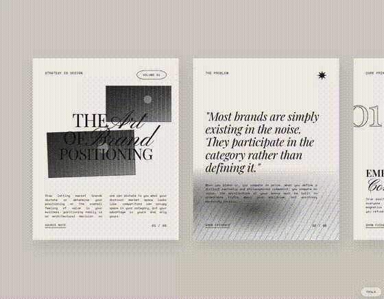</a><br>
<strong><a href="https://clockless-org.github.io/html-anything/examples/editorial-carousel/output.html">Argument as sequence →</a></strong><br>
<sub>Source: strategy essay · Style: <code>editorial-carousel</code></sub>
</td>
<td width="50%" valign="top">
<a href="https://clockless-org.github.io/html-anything/examples/pdf/output.html">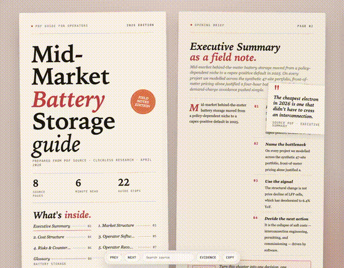</a><br>
<strong><a href="https://clockless-org.github.io/html-anything/examples/pdf/output.html">Guide from dense document →</a></strong><br>
<sub>Source: PDF report · Style: <code>digital-eguide</code></sub>
</td>
</tr>
<tr>
<td width="50%" valign="top">
<a href="https://clockless-org.github.io/html-anything/examples/email/output.html">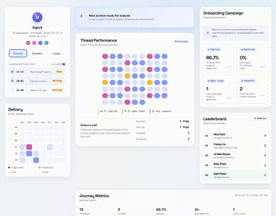</a><br>
<strong><a href="https://clockless-org.github.io/html-anything/examples/email/output.html">Inbox or workstream audit →</a></strong><br>
<sub>Source: Mbox archive · Style: <code>soft-saas</code></sub>
</td>
<td width="50%" valign="top">
<a href="https://clockless-org.github.io/html-anything/examples/ci-log/output.html">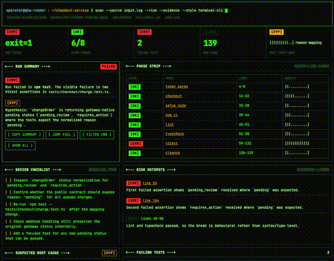</a><br>
<strong><a href="https://clockless-org.github.io/html-anything/examples/ci-log/output.html">Debugging evidence →</a></strong><br>
<sub>Source: CI log · Style: <code>terminal-cli</code></sub>
</td>
</tr>
</table>


### Conversation Analysis

<table>
<tr>
<td width="50%" valign="top">
<a href="https://clockless-org.github.io/html-anything/examples/wechat-couple/output.html"></a><br>
<strong><a href="https://clockless-org.github.io/html-anything/examples/wechat-couple/output.html">Private chat recap →</a></strong><br>
<sub>Source: 1:1 chat export · Style: <code>love-romance-3d</code></sub>
</td>
<td width="50%" valign="top">
<a href="https://clockless-org.github.io/html-anything/examples/slack/output.html">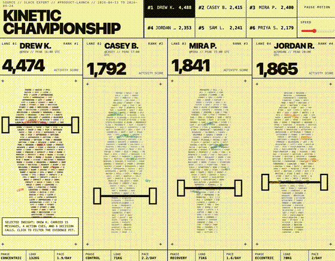</a><br>
<strong><a href="https://clockless-org.github.io/html-anything/examples/slack/output.html">Group contribution analysis →</a></strong><br>
<sub>Source: team chat export · Style: <code>kinetic-scoreboard</code></sub>
</td>
</tr>
</table>


### Personal Data & Places

<table>
<tr>
<td width="50%" valign="top">
<a href="https://clockless-org.github.io/html-anything/examples/kindle-highlights/output.html">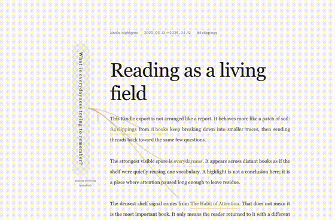</a><br>
<strong><a href="https://clockless-org.github.io/html-anything/examples/kindle-highlights/output.html">Reflective reading archive →</a></strong><br>
<sub>Source: My Clippings.txt · Style: <code>living-essay</code></sub>
</td>
<td width="50%" valign="top">
<a href="https://clockless-org.github.io/html-anything/examples/travel-history/output.html">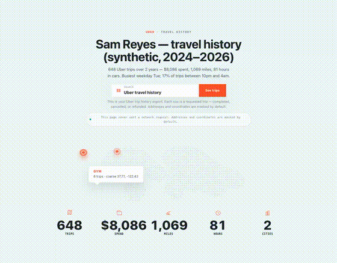</a><br>
<strong><a href="https://clockless-org.github.io/html-anything/examples/travel-history/output.html">Mobility recap →</a></strong><br>
<sub>Source: Uber/Lyft CSV · Style: <code>global-travel</code></sub>
</td>
</tr>
</table>

## Install

### Recommended — Agent Skills CLI

One command, works across Claude Code, Codex, Cursor, Cline, Windsurf
and any other agent that follows the [open agent skills](https://skills.sh)
spec:

```bash
npx skills add clockless-org/html-anything
```

The CLI also pings the public skills directory, so installs feed the
[skills.sh leaderboard](https://skills.sh/clockless-org/html-anything).

### Manual install (Claude Code)

```bash
mkdir -p ~/.claude/skills
git clone https://github.com/clockless-org/html-anything ~/.claude/skills/html-anything
```

Restart Claude Code so it loads `SKILL.md`.

### Manual install (Codex)

```bash
mkdir -p "${CODEX_HOME:-$HOME/.codex}/skills"
git clone https://github.com/clockless-org/html-anything "${CODEX_HOME:-$HOME/.codex}/skills/html-anything"
```

Restart Codex so it loads the skill.

To update a manual install later:

```bash
git -C ~/.claude/skills/html-anything pull
```

### Publish To ClawHub

This repo includes `.clawhubignore` so ClawHub publishes only the skill bundle:
`SKILL.md` plus `prompts/`. It intentionally excludes examples, screenshots,
fixtures, generated outputs, source code, and the repo license file.

```bash
npm i -g clawhub
clawhub login
clawhub skill publish . \
  --owner YOUR_HANDLE_OR_ORG \
  --version 0.1.0 \
  --clawscan-note "Creates local HTML pages from user-provided prompts, files, folders, and URLs. Reads local files only when the user asks."
```

## Use

Ask in plain language:

```text
Use html-anything to create an interactive teaching site about the solar system.
```

```text
Explain the solar system as a beautiful interactive page.
```

```text
Use html-anything on my Amazon order history. Walk me through the export first.
```

```text
Use html-anything to turn ~/Downloads/_chat.txt into a relationship report.
```

```text
Use html-anything to make this CSV into a shareable dashboard.
```

```text
Use html-anything on this GitHub repo URL.
```

You do not always need to say "HTML". Requests like "make this easier to read",
"turn this into a visual report", "make a shareable explainer", "create a recap",
or "present this beautifully" should trigger the skill.

If you already have the file, folder, or URL, give it to the agent. If
you only know the source type, such as "Amazon orders", "Spotify history",
"1:1 chat export", or "Google Photos Takeout", the skill first explains how
to export the data, then converts it after you provide the export.

## Input And Output

| Input | What you give | What you get |
|---|---|---|
| Rich answer | A topic, analysis request, comparison, recap, brief, or teaching goal | A readable, styled HTML artifact instead of a long written answer |
| Idea | A short brief, e.g. "make a solar system teaching site" | A generated educational / interactive HTML page |
| File | CSV, JSON, Markdown, PDF, DOCX, chat export, log, transcript, statement | A live page designed for that file |
| Folder | Notes vault, Google Photos Takeout, Notion export, repo, exported archive | A browsable atlas / dashboard / audit page |
| URL | Article, GitHub repo, public webpage | A shareable HTML reading or exploration page |
| Export request | "My Amazon orders", "my Spotify history", "my relationship chat" | Export instructions first, then a live HTML page |

The output is a browser page, not a chat reply. Most outputs are a single
`output.html`. When the page needs generated images or other local
assets, the skill returns `output.html + assets/`. Ask for "single-file"
if you need everything in one HTML file.

## Automatic Usage Routing

You do not need to choose a style. The default is `auto`.

Routing has three layers:

| Layer | Meaning |
|---|---|
| Use case | The user's job: teaching, files/work data, conversation analysis, or personal data/places |
| Source | The input shape: prompt, CSV, PDF, DOCX, chat export, log, repo, folder, URL |
| Style | The design system + layout system used to make the HTML readable |

Styles are not CSS skins. The skill picks the system from the content, then
builds the page inside that system. Every non-fallback style has a checked-in
live example and screenshot preview.

Style fidelity is part of the contract: when a style is based on a reference
HTML or screenshot, the generated page should reproduce the reference's first
viewport, component vocabulary, interaction model, motion grammar, and visual
absence rules. Source modules are translated into the style instead of forcing
every output into the same dashboard/report shape.

| Usage pattern | Style |
|---|---|
| Unknown or mixed inputs | `default` (Insight Brief) |
| Tutorials, lessons, explainers, "teach me" prompts | `teaching` (Lesson Lab) |
| 1:1 chats and intimate message exports | `love-romance-3d` (Keepsake 3D Rhythm) |
| Reflective essays, Kindle highlights, idea notes, concept-heavy reading archives | `living-essay` (Mycelium Writing Environment) |
| Multi-participant activity streams, team chats, ranked contributors, owner/reps/players by workload | `kinetic-scoreboard` (Kinetic Championship) |
| Personal histories — chronological (orders, history, listening, health) **and** topical (Notion / Obsidian vaults) | `timeline-story` (Timeline Story) |
| Travel history, Uber/Lyft exports, and personal mobility recaps | `global-travel` (Global Travel Map) |
| Places, trips, routes, geotagged photos | `map-atlas` (Map Atlas) |
| Contacts, communities, social payments | `network-map` (Network Map) |
| Support mailboxes, email campaigns, onboarding, customer-success queues | `soft-saas` (Soft SaaS Console) |
| Finance, spreadsheets, logs, backlog, operational data | `dashboard` (Ops Console) |
| Essays, articles, reading lists, bookmarks, PDFs, DOCX, legal/medical/lab records | `document` (Document Review) |
| Long prose, DOCX memos, articles, essays, and manuscripts meant for sustained reading | `kami-reading` (Kami Longform Reader) |
| Long-form visual explainers, object-focused articles, architectural split-screen editorial requests | `architectural-spread` (Architectural Editorial Spread) |
| E-guides, PDF guides, creator guides, playbooks, lead magnets | `digital-eguide` (Digital E-Guide Spread) |
| Brand strategy essays, founder letters, article takeaways, lightweight reports meant to be shared as a sequence | `editorial-carousel` (Editorial Carousel) |
| Explicit terminal, CLI, shell, mainframe, hacker-console requests | `terminal-cli` (Terminal CLI, explicit override) |
| Logs, PR patches, stack traces, CI failures, repos | `developer` (Terminal Evidence Workbench) |

You can still steer it naturally: "make it more tutorial-like", "more
app-like", "less academic", "make it a carousel", "more dashboard-like",
or "more playful".

Reusable style prompts live in [`prompts/styles/`](./prompts/styles/).
The shared structural contract is
[`prompts/styles/_system.md`](./prompts/styles/_system.md). The internal
style catalog lives in [`prompts/styles/catalog.json`](./prompts/styles/catalog.json):
it records the four use cases plus each style's triggers, best sources,
example, preview, required primitives, and avoid rules so generation can stay
style-faithful without asking users to pick options. There is a fallback
`default` style plus 17 concrete style systems, each with a live example and
preview asset.

Example explicit style override:

```bash
npx tsx src/cli.ts examples/pdf/input.pdf \
  --style digital-eguide \
  --out /tmp/battery-storage-guide.html \
  --title "Mid-Market Battery Storage Field Guide"
```

## Use Cases And Sources

Sources can be endless, but the skill routes them into four stable use cases.
Each use case can use one or more style systems.

| Use case | Example sources | Likely styles |
|---|---|---|
| Teaching Studios | A short teaching brief, article, lesson outline, concept note, URL, Markdown, DOCX, or PDF/document simplification request | `teaching`, `architectural-spread`, `kami-reading` |
| Files & Work Data | CSV / TSV, spreadsheet-style exports, JSON, JSONL, logs, CI output, PR patches, stack traces, repos, email/support archives, bank transactions, invoices, QuickBooks, calendars, issue trackers, Markdown, PDF, DOCX, bookmarks, URL lists, bibliographies, research records, slide-style carousel outputs | `dashboard`, `soft-saas`, `document`, `kami-reading`, `architectural-spread`, `digital-eguide`, `editorial-carousel`, `developer`, `terminal-cli` |
| Conversation Analysis | WeChat, iMessage-style CSV, Slack, Discord, Telegram, email-style threads | `love-romance-3d`, `kinetic-scoreboard`, `network-map` |
| Personal Data & Places | Amazon orders, Apple Health, browser history, YouTube, Spotify, Twitch, Kindle highlights, Venmo / PayPal, AI chat exports, notes vaults, Google Maps saved places, travel history, GPX, KML, itinerary CSV, location history | `timeline-story`, `global-travel`, `living-essay`, `network-map`, `map-atlas` |

Use case is user-facing; style is internal. A user can simply say "make this
CSV prettier" or "turn this into a teaching site" and the skill picks the
right system automatically.

The detailed source-specific instructions live in [`prompts/sources/`](./prompts/sources/).

## Defaults

- The skill chooses the style automatically.
- The skill samples large sources, but renders the full data where practical.
- The skill checks the page in a browser before handing it back.
- Generated pages are local-first and static. They can be opened directly or hosted anywhere static HTML works.
- Generated HTML can embed private source data client-side. Treat the output as sensitive as the original export.
- Sensitive-record outputs are for organization and review only, not medical, legal, tax, accounting, immigration, insurance, or investment advice.

## Developer Note

This repo also contains a standalone parser / CLI framework used by some
examples, but the primary product surface is the agent skill. Users should
not need to understand the internal implementation to use html-anything.

```bash
git clone https://github.com/clockless-org/html-anything
cd html-anything
npm install
export ANTHROPIC_API_KEY=sk-ant-...   # or OPENAI_API_KEY=sk-...
npx tsx src/cli.ts examples/csv/input.csv --out /tmp/customers.html
```

## License

[Apache 2.0](./LICENSE)
