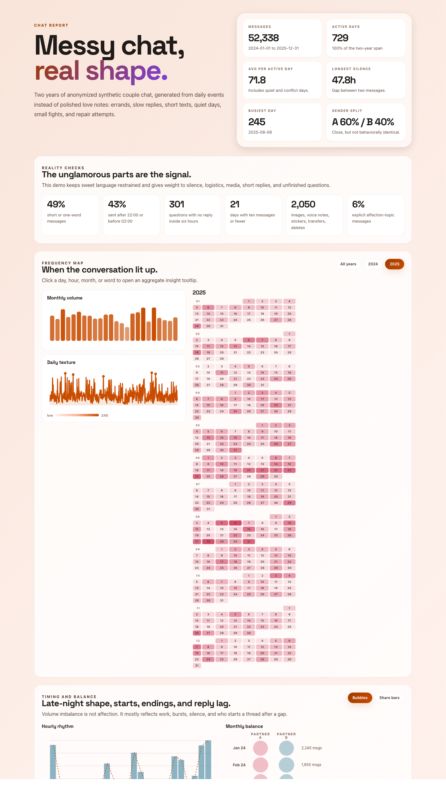
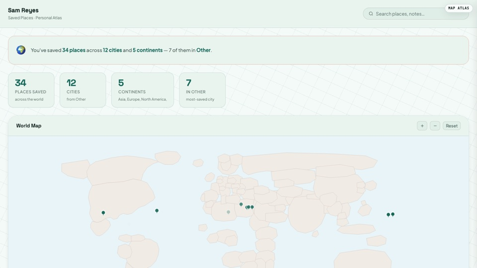

# html-anything

[](https://skills.sh/clockless-org/html-anything)

Turn an idea, file, folder, or URL into a polished live HTML page.

`html-anything` is a Codex / Claude Code skill. Give it a prompt like
"create an interactive teaching site about the solar system", or give it
an export like Amazon orders, WhatsApp chat, a CSV, a transcript, a repo,
or a folder of notes. The skill figures out the source, chooses the page
style automatically, builds the HTML, checks it in a browser, and gives
you something you can open, share, or publish.

## Preview

→ **[Open the curated gallery](https://clockless-org.github.io/html-anything/examples/)** — 20 demos, organized by source and style.

### Featured

#### [Interactive teaching site →](https://clockless-org.github.io/html-anything/examples/solar-system-studio/output.html)

[](https://clockless-org.github.io/html-anything/examples/solar-system-studio/output.html)

A self-contained interactive lesson built from a single prompt — *"create an interactive teaching site about the solar system"*. Each planet has its own stage with orbit controls, comparison tools, and a try-it quiz. No tutoring software, no slides, no setup. Style: `teaching`.

#### [Couple chat relationship report →](https://clockless-org.github.io/html-anything/examples/wechat-couple/output.html)

[](https://clockless-org.github.io/html-anything/examples/wechat-couple/output.html)

A WhatsApp / WeChat export reduced to its **rhythm story** — who initiates, response times, peak-hour patterns, mood cadence — without ever exposing private text. Aggregate-first, anonymized evidence. Style: `relationship`.

#### [Saved places atlas →](https://clockless-org.github.io/html-anything/examples/google-maps-stars/output.html)

[](https://clockless-org.github.io/html-anything/examples/google-maps-stars/output.html)

Your Google Maps starred places on a personal world atlas. Hover for the note you wrote at the time, click to expand. Built from a Takeout CSV in seconds. Style: `map-atlas`.

### More demos

A small selection across the rest of the style catalog. Each links to the live page.

| Demo | One-line | Style |
|---|---|---|
| [Amazon order history →](https://clockless-org.github.io/html-anything/examples/amazon-orders/output.html) | 3 years of orders → personal commerce memory with cadence, returns, gifting. | `timeline-story` |
| [Kindle highlights →](https://clockless-org.github.io/html-anything/examples/kindle-highlights/output.html) | Highlights become a mycelium writing field with a living margin question. | `living-essay` |
| [Apple Health →](https://clockless-org.github.io/html-anything/examples/iphone-health/output.html) | Activity, sleep, and workouts become a personal rhythm story. | `timeline-story` |
| [LinkedIn connections →](https://clockless-org.github.io/html-anything/examples/linkedin-connections/output.html) | 12 years of connections clustered by company, role, and era. | `network-map` |
| [CSV sales dashboard →](https://clockless-org.github.io/html-anything/examples/csv/output.html) | A small CSV becomes a sortable + summarized ops console. | `dashboard` |
| [Google Photos atlas →](https://clockless-org.github.io/html-anything/examples/google-photos-takeout/output.html) | Takeout EXIF metadata becomes a place-driven memory map. | `map-atlas` |
| [PR review →](https://clockless-org.github.io/html-anything/examples/pr-review/output.html) | A patch becomes a risk-annotated review brief with evidence. | `developer` |

→ **[See the curated gallery (20 demos) →](https://clockless-org.github.io/html-anything/examples/)**

## Install

### Codex

```bash
mkdir -p "${CODEX_HOME:-$HOME/.codex}/skills"
git clone https://github.com/clockless-org/html-anything "${CODEX_HOME:-$HOME/.codex}/skills/html-anything"
```

Restart Codex so it loads the skill.

### Claude Code

```bash
mkdir -p ~/.claude/skills
git clone https://github.com/clockless-org/html-anything ~/.claude/skills/html-anything
```

Restart Claude Code so it loads `SKILL.md`.

### Agent Skills CLI

```bash
npx skills add clockless-org/html-anything
```

To update a manual install later:

```bash
git -C "${CODEX_HOME:-$HOME/.codex}/skills/html-anything" pull
```

## Use

Ask in plain language:

```text
Use html-anything to create an interactive teaching site about the solar system.
```

```text
Use html-anything on my Amazon order history. Walk me through the export first.
```

```text
Use html-anything to turn ~/Downloads/_chat.txt into a relationship report.
```

```text
Use html-anything to make this CSV into a shareable dashboard.
```

```text
Use html-anything on this GitHub repo URL.
```

If you already have the file, folder, or URL, give it to the agent. If
you only know the source type, such as "Amazon orders", "Spotify history",
"WhatsApp chat", or "Google Photos Takeout", the skill first explains how
to export the data, then converts it after you provide the export.

## Input And Output

| Input | What you give | What you get |
|---|---|---|
| Idea | A short brief, e.g. "make a solar system teaching site" | A generated educational / interactive HTML page |
| File | CSV, JSON, Markdown, PDF, DOCX, chat export, log, transcript, statement | A live page designed for that file |
| Folder | Notes vault, Google Photos Takeout, Notion export, repo, exported archive | A browsable atlas / dashboard / audit page |
| URL | Article, GitHub repo, public webpage | A shareable HTML reading or exploration page |
| Export request | "My Amazon orders", "my Spotify history", "my WhatsApp chat" | Export instructions first, then a live HTML page |

The output is a browser page, not markdown. Most outputs are a single
`output.html`. When the page needs generated images or other local
assets, the skill returns `output.html + assets/`. Ask for "single-file"
if you need everything in one HTML file.

## Automatic Styles

You do not need to choose a style. The default is `auto`.

Styles are design systems + layout systems, not CSS skins. The skill picks
the system from the content, then builds the page inside that system:

Style fidelity is part of the contract: when a style is based on a reference
HTML or screenshot, the generated page should reproduce the reference's first
viewport, component vocabulary, interaction model, motion grammar, and visual
absence rules. Source modules are translated into the style instead of forcing
every output into the same dashboard/report shape.

| Content | Style |
|---|---|
| Unknown or mixed inputs | `default` (Insight Brief) |
| Tutorials, lessons, explainers, "teach me" prompts, object/system explorers | `teaching` (Lesson Lab) |
| 1:1 chats and intimate message exports | `relationship` (Rhythm Report) |
| Reflective essays, Kindle highlights, idea notes, concept-heavy reading archives | `living-essay` (Mycelium Writing Environment) |
| Personal histories — chronological (orders, history, listening, health) **and** topical (Notion / Obsidian vaults) | `timeline-story` (Timeline Story) |
| Places, trips, routes, rideshare, geotagged photos | `map-atlas` (Map Atlas) |
| Contacts, LinkedIn, communities, email, social payments | `network-map` (Network Map) |
| Finance, spreadsheets, logs, backlog, operational data | `dashboard` (Ops Console) |
| Essays, articles, reading lists, bookmarks, PDFs, DOCX, legal/medical/lab records | `document` (Document Review) |
| Logs, diffs, stack traces, CI failures, repos | `developer` (Evidence Workbench) |

You can still steer it naturally: "make it more tutorial-like", "more
app-like", "less academic", "more dashboard-like", or "more playful".

Reusable style prompts live in [`prompts/styles/`](./prompts/styles/).
The shared structural contract is
[`prompts/styles/_system.md`](./prompts/styles/_system.md). There is a
fallback `default` style plus 9 auto-selected styles:
`teaching`, `relationship`, `living-essay`, `dashboard`,
`timeline-story`, `map-atlas`, `network-map`, `document`, and
`developer`.

## Source Examples

|  | Source family | Examples |
|---|---|---|
| 💾 | Personal exports | Amazon orders, rideshare history, browser history (Chrome / Edge / Safari / Firefox), YouTube watch history, Spotify history, Google Maps saved places, Apple Health, Twitch, Kindle highlights |
| 🖼️ | Photos and contacts | Google Photos Takeout metadata, vCard contacts, LinkedIn connections |
| 💬 | Chats and communities | WeChat, WhatsApp, Slack, Discord, Telegram, iMessage-style CSV |
| 📊 | Data and operations | CSV / TSV, JSON, JSONL, logs, bank transactions, invoices, QuickBooks, Venmo / PayPal, calendar, issue trackers |
| 📚 | Documents and research | Markdown, PDF, DOCX, email archives, bookmarks, URL lists, bibliographies, reading lists, Notion / Obsidian / markdown folders |
| 🛠️ | Developer artifacts | Git diff, PR patch, CI log, stack trace, GitHub repo URL |
| 🗺️ | Geo and travel | GPX, KML, itinerary CSV, location history |
| 🔒 | Sensitive records | Medical visit notes, lab results, legal chronologies |
| 🤖 | AI chat exports | ChatGPT, Claude, generic AI chat logs |
| ✨ | Anything else | Plain text, unknown file shapes, or a natural-language idea |

The detailed source-specific instructions live in [`prompts/`](./prompts/).

## Defaults

- The skill chooses the style automatically.
- The skill samples large sources, but renders the full data where practical.
- The skill checks the page in a browser before handing it back.
- Generated pages are local-first and static. They can be opened directly or hosted anywhere static HTML works.
- Generated HTML can embed private source data client-side. Treat the output as sensitive as the original export.
- Sensitive-record outputs are for organization and review only, not medical, legal, tax, accounting, immigration, insurance, or investment advice.

## Developer Note

This repo also contains a standalone parser / CLI framework used by some
examples, but the primary product surface is the agent skill. Users should
not need to understand the internal implementation to use html-anything.

```bash
git clone https://github.com/clockless-org/html-anything
cd html-anything
npm install
export ANTHROPIC_API_KEY=sk-ant-...   # or OPENAI_API_KEY=sk-...
npx tsx src/cli.ts examples/csv/input.csv --out /tmp/customers.html
```

## License

[Apache 2.0](./LICENSE)
